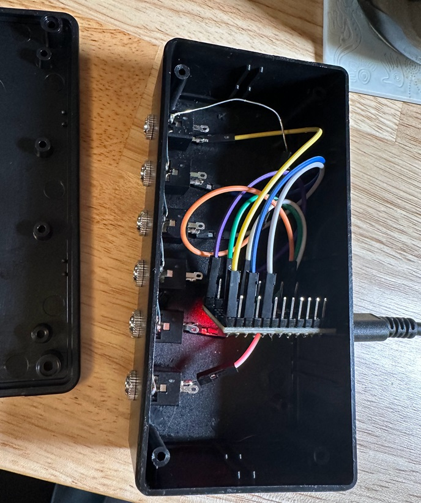
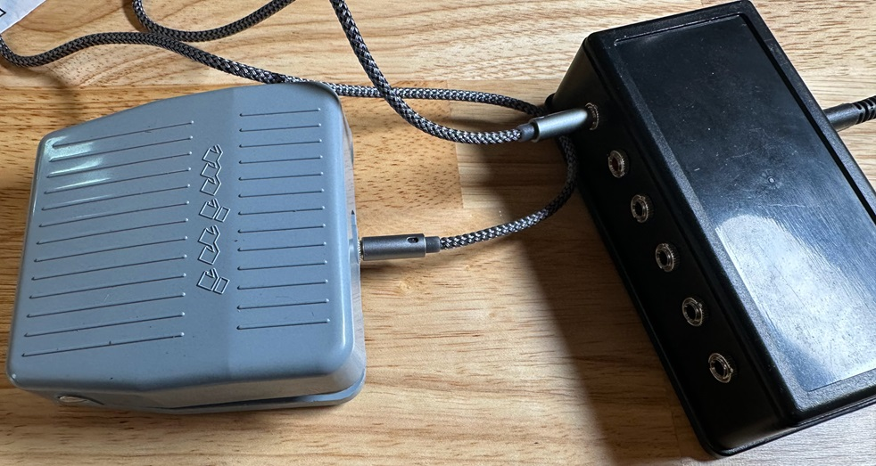
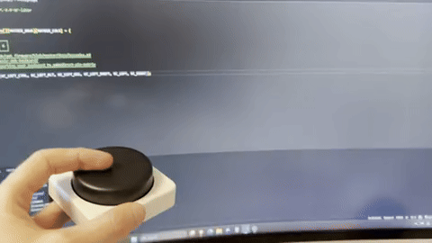

# qmk-footsie
Direct wired QMK footswitch keyboard

## Materials
- project box
- 6x PJ301M 3.5mm TRS socket
- Pro Micro
- Switches wired to 3.5mm (headphones) cable

## Build Steps
1. Drill holes in project box
1. Fasten 3.5mm sockets in holes
1. Wire ground together (sleeve connection) and solder
1. Wire each sockets tip connection to its own GPIO pin
1. Move footsie to qmk_firmware/keyboards
1. Build and flash firmware `make footsie:default:flash`
    - Short rst to gnd when prompted
1. Wire footpedal momentary switches to 3.5mm jacks so that common goes to sleeve and No goes to tip (spdt) or one side to each (spst)

